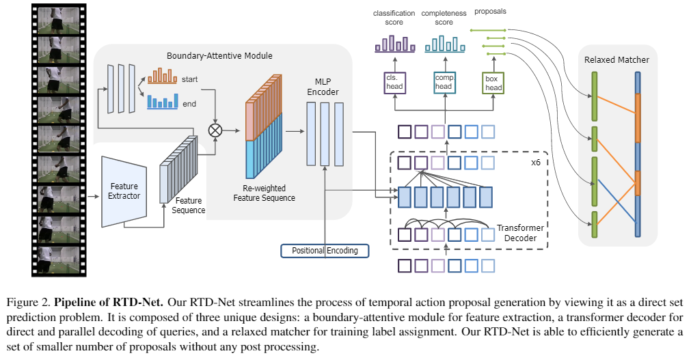
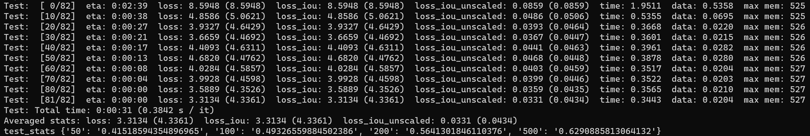

# RTD-Net (ICCV 2021)

This repo holds the codes of paper: "Relaxed Transformer Decoders for Direct Action Proposal Generation", accepted in ICCV 2021.

# News

[2022.4.4] We release codes, checkpoint and features on ActivityNet-1.3.  
**[2021.8.17]** We release codes, checkpoint and features on THUMOS14.



## Overview

This paper presents a simple and end-to-end learnable framework (RTD-Net) for direct action proposal generation, by re-purposing a Transformer-alike architecture. Thanks to the parallel decoding of multiple
proposals with explicit context modeling, our RTD-Net outperforms the previous state-of-the-art methods in temporal
action proposal generation task on THUMOS14 and also
yields a superior performance for action detection on this
dataset. In addition, free of NMS post-processing, our detection pipeline is more efficient than previous methods.

## Dependencies

- Python 3.7 or higher
- [PyTorch](https://pytorch.org/) **1.6** or higher
- [Torchvision](https://github.com/pytorch/vision)
- [Numpy](https://numpy.org/) 1.19.2

## Data Preparation

To reproduce the results in THUMOS14 without further changes:

1. Download the data from [GoogleDrive](https://drive.google.com/drive/folders/13KwgSgeZKWwIYE77PVo4_dvZhf8qQisJ?usp=sharing).

2. Place I3D_features and TEM_scores into the folder `data`.

## Checkpoint

Dataset  | AR@50 | AR@100 | AR@200 | AR@500 | checkpoint
:--: | :--: | :--: | :--:|  :--:| :--:
THUMOS14 | 41.52 | 49.33 | 56.41 | 62.91 | [link](https://drive.google.com/file/d/1h20GnPhaJP3QkwVspn_ndXevJ97FGpE6/view?usp=sharing)



## Training

Use `train.sh` to train RTD-Net.

```

# First stage

CUDA_VISIBLE_DEVICES=0,1 python -m torch.distributed.launch --nproc_per_node=2 --master_port=11323 --use_env main.py --window_size 100 --batch_size 32 --stage 1 --num_queries 32 --point_prob_normalize

# Second stage for relaxation mechanism

CUDA_VISIBLE_DEVICES=0,1 python -m torch.distributed.launch --nproc_per_node=2 --master_port=11324 --use_env main.py --window_size 100 --batch_size 32 --lr 1e-5 --stage 2 --epochs 10 --lr_drop 5 --num_queries 32 --point_prob_normalize --load outputs/checkpoint_best_sum_ar.pth

# Third stage for completeness head

CUDA_VISIBLE_DEVICES=0,1 python -m torch.distributed.launch --nproc_per_node=2 --master_port=11325 --use_env main.py --window_size 100 --batch_size 32 --lr 1e-4 --stage 3 --epochs 20 --num_queries 32 --point_prob_normalize --load outputs/checkpoint_best_sum_ar.pth
```

## Testing

Inference with `test.sh`.

```
CUDA_VISIBLE_DEVICES=0,1 python -m torch.distributed.launch --nproc_per_node=2 --master_port=11325 --use_env main.py --window_size 100 --batch_size 32 --lr 1e-4 --stage 3 --epochs 20 --num_queries 32 --point_prob_normalize --eval --resume outputs/checkpoint_best_sum_ar.pth
```

## References

We especially thank the contributors of the [BSN](https://github.com/wzmsltw/BSN-boundary-sensitive-network), [G-TAD](https://github.com/frostinassiky/gtad) and [DETR](https://github.com/facebookresearch/detr) for providing helpful code.

## Citations

If you think our work is helpful, please feel free to cite our paper.

```
@InProceedings{Tan_2021_RTD,
    author    = {Tan, Jing and Tang, Jiaqi and Wang, Limin and Wu, Gangshan},
    title     = {Relaxed Transformer Decoders for Direct Action Proposal Generation},
    booktitle = {Proceedings of the IEEE/CVF International Conference on Computer Vision (ICCV)},
    month     = {October},
    year      = {2021},
    pages     = {13526-13535}
}
```

## Contact

For any question, please file an issue or contact

```
Jing Tan: jtan@smail.nju.edu.cn
Jiaqi Tang: jqtang@smail.nju.edu.cn
```
